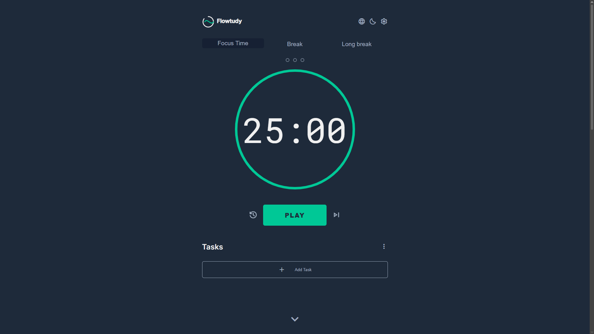

# Flowtudy — Pomodoro + Tarefas (Vanilla JS)

[](./LICENSE)
[](https://github.com/FlavioTomas/Flowtudy-Pomodoro)


Um aplicativo **Pomodoro** completo para estudos e produtividade, com **gerenciador de tarefas**, **multi-idioma**, **tema claro/escuro**, **notificações**, **indicador de ciclos** e **persistência via localStorage** — feito com **HTML, CSS e JavaScript puro**.

- Repositório: <https://github.com/FlavioTomas/Flowtudy-Pomodoro>

---

## Demonstração

### Vídeo

- Link: [`assets/demo.mp4`](./assets/demo.mp4)

> Observação: o GitHub nem sempre reproduz MP4 inline no README. O link acima normalmente abre/baixa o arquivo.

### Screenshot



---

## Sumário

- [Features](#features)
- [Tecnologias](#tecnologias)
- [Como executar localmente](#como-executar-localmente)
- [Como publicar no GitHub Pages](#como-publicar-no-github-pages)
- [Como usar](#como-usar)
- [Configurações](#configurações)
- [Persistência (localStorage)](#persistência-localstorage)
- [Estrutura do projeto](#estrutura-do-projeto)
- [Terceiros (áudio, fontes e ícones)](#terceiros-áudio-fontes-e-ícones)
- [Licença](#licença)
- [Autor](#autor)

---

## Features

### Timer Pomodoro

- Modos: **Focus**, **Break**, **Long Break**
- **Anel de progresso circular** (progress ring)
- **Indicador de ciclos** (pontos que completam até o intervalo longo)
- Controles: **Play/Pause**, **Reset**, **Skip**
- Atualiza o **título da aba** com o tempo restante

### Tarefas

- Criar, concluir, editar e excluir tarefas
- **Drag-and-drop** para reordenar
- Menu de ações:
  - Excluir todas
  - Excluir concluídas
  - Ocultar/mostrar concluídas
- Modal de confirmação para ações destrutivas

### Personalização

- Ajuste de duração:
  - Focus
  - Break
  - Long Break
- **Long Break** a cada *N* intervalos
- **Tema claro/escuro**
- **Idiomas:** EN / PT-BR / ES

### Notificações

- Som ao finalizar o timer (opcional)
- Notificação do navegador (opcional, depende de permissão)

---

## Tecnologias

- **HTML5**
- **CSS3** (variáveis CSS, clamp, animações, layout responsivo)
- **JavaScript (Vanilla)**
- **localStorage**
- **Notification API**
- **IntersectionObserver**
- Google Fonts (Inter, Roboto Mono)
- Material Symbols (Google)

---

## Como executar localmente

### Opção A) VS Code + Live Server (recomendado)

1. Clone o repositório:

   ```bash
   git clone https://github.com/FlavioTomas/Flowtudy-Pomodoro.git
   ```

2. Entre na pasta:

   ```bash
   cd Flowtudy-Pomodoro
   ```

3. Abra `index.html` com Live Server (VS Code).

### Opção B) Python HTTP Server

Na pasta do projeto:

```bash
python -m http.server 5500
```

Abra:

```text
http://localhost:5500
```

---

## Como publicar no GitHub Pages

1. No GitHub, vá em **Settings → Pages**.
2. Em **Build and deployment**:
   - Source: **Deploy from a branch**
   - Branch: `main`
   - Folder: `/root`
3. Salve e aguarde o GitHub gerar a URL.

URL típica:

- <https://FlavioTomas.github.io/Flowtudy-Pomodoro/>

---

## Como usar

1. Selecione um modo (**Focus/Break/Long Break**).
2. Clique em **PLAY** para iniciar.
3. Adicione tarefas em **Add Task**.
4. Ajuste preferências no painel **Settings**.
5. Troque idioma pelo botão de **Language**.

---

## Configurações

No painel **Settings**, você pode:

- Ativar/desativar:
  - Auto Start Breaks
  - Auto Start Focus
  - Sound Alarm
  - Pop-up Notification
- Definir:
  - Tempo de Focus, Break e Long Break
  - Intervalo do Long Break (a cada N breaks)

> Pop-up: ao ativar, o navegador pode pedir permissão (`Notification.requestPermission()`).

---

## Persistência (localStorage)

O Flowtudy salva:

- **Configurações**: `flowtudySettings`
- **Tarefas**: `flowtudyTasks`
- **Estado do timer**: `flowtudyTimerState`
- **Idioma**: `flowtudyLanguage`

---

## Estrutura do projeto

```txt
.
├── index.html
├── style.css
├── script.js
├── LICENSE
├── THIRD_PARTY_NOTICES.md
└── assets/
    ├── favicon.svg
    ├── notification-sound.mp3
    ├── demo.mp4              
    └── screenshot.png        
```

---

## Terceiros (áudio, fontes e ícones)

Este projeto utiliza recursos de terceiros (áudio, fontes e ícones).

Veja detalhes em **[THIRD_PARTY_NOTICES.md](./THIRD_PARTY_NOTICES.md)**.

---

## Licença

O código deste projeto é licenciado sob a licença **MIT**.

Veja o arquivo **[LICENSE](./LICENSE)**.

> Observação: assets/recursos de terceiros (áudio, fontes, ícones) possuem licenças próprias — veja [THIRD_PARTY_NOTICES.md](./THIRD_PARTY_NOTICES.md).

---

## Autor

**Flávio Tomás Peña Villa**  
Projeto: **Flowtudy** (Jan/2026)
